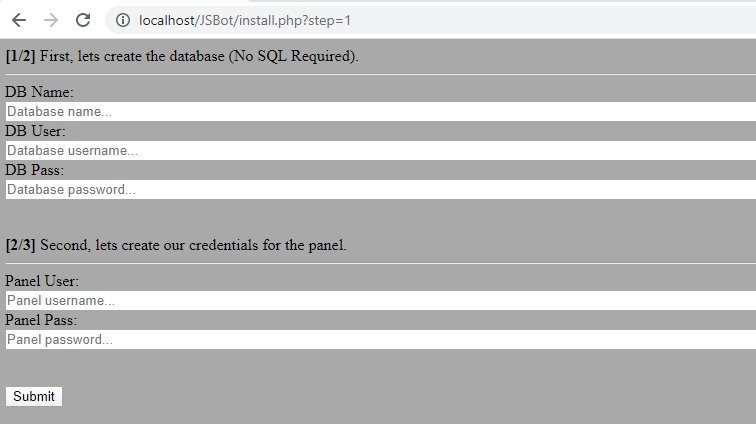
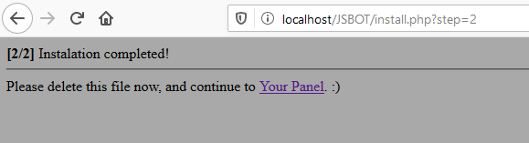
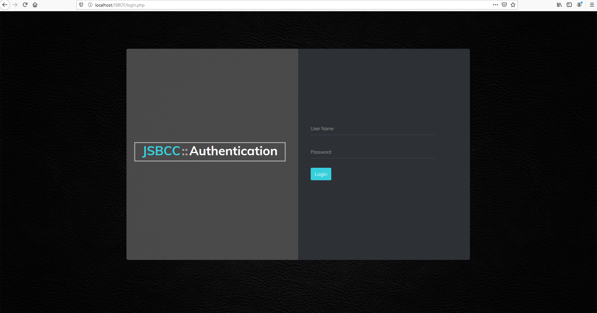
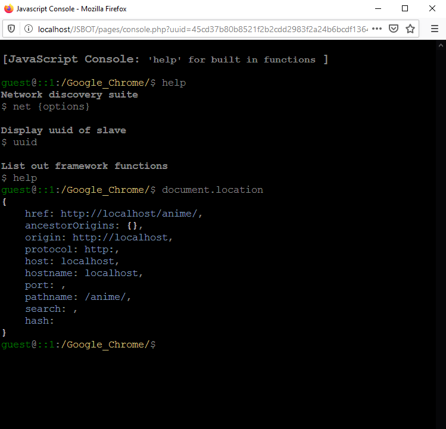
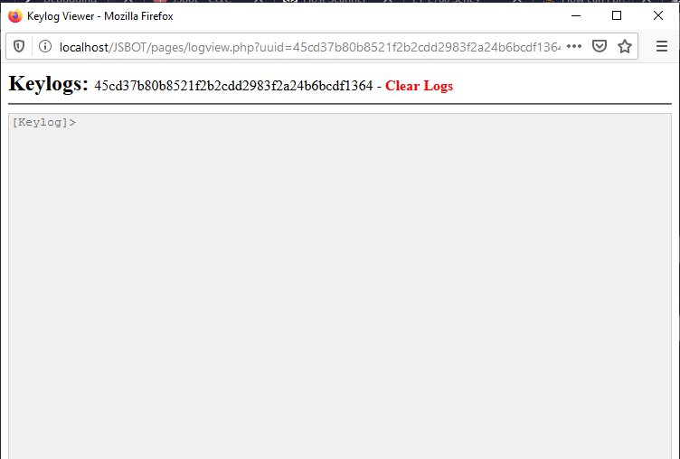
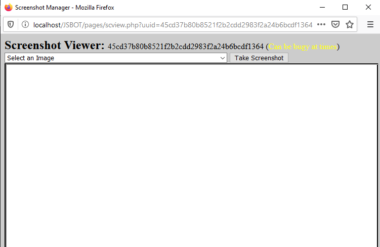

# JSBot v2
A javascript based botnet/C&amp;C to remotely manage/control browsers for post-exploitation.

Instalation Instructions
------------------------
1. Upload the files to your domain you plan to use to host the panel
2. Run and go through the steps in ``install.php`` (Note, no need to create an SQL database or anything of the like as this is powered by PHD)

3. After that, delete the ``install.php`` file, and log into your panel.

<b>NOTE: Unless you have this hosted on a domain with valid and active HTTPS then injection into HTTPS pages will not work.</b>

There will be a link to the js server file you can include in a web page if you want to monitor visitors, and there will also be a link in the panel to download an automatically created universal browser plugin which you can load into Chrome, Firefox, or Edge to control.

Also note that this utilizes long polling for communication between server and panel, so commands can take as long as 30 seconds to become active once sent.

DISCLAIMER
----------
Be responsible, because I take no responsibility for the misuse of this software.

SOME SCREENSHOTS OF THE PANEL IN ACTION
---------------------------------------

